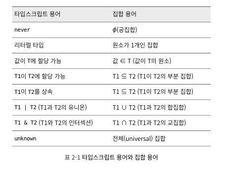

# 타입이 값들의 집합이라고 생각하기

타입을 '할당 가능한 값들의 집합'이라고 생각합니다.

가장 작은 집합은 아무 값도 포함하지 않는 공집합이며, 타입스트립트에서는 `never`타입 입니다.

그 다음으로 작은 집합은 한 가지 값만 포함하는 타입으로, 유니(unit)타입이라고도 불리는 `literal`타입 입니다.

```typescript
type A = 'A';
type B = 'B';

type AB = 'A' | 'B';
```

두 개 혹은 세 개로 묶으려면 `union`타입을 사용합니다.

타입스크립트 오류 중 '할당 가능한'이라는 문구는 집합의 관점에서 '~의 원소' 또는 '~의 부분 집합'을 의미합니다.

```typescript
type Int = 1 | 2 | 3 | 4 | 5; // ...
```

실제 다루게 되는 타입은 대부분 범위가 무한대 입니다. 범위가 무한대인 타입은 원소들을 일일이 추가해서 만든 걸로 생각할 수도 있습니다.

```typescript
interface Person {
  name: string;
  age: number;
  address: string;
}

interface Lifespan {
  birth: Date;
  death: Date;
}

type PersonSpan = Person & Lifespan;

const person: Person = {
  name: 'joon',
  age: 12,
  address: 'abc',
  birth: 20,
};
```

`&`연산자는 두 타입의 인터섹션(intersection, 교집합)을 계산합니다. 타입 연산자는 인터페이스의 속성이 아닌, 값의 집합(타입의 범위)에 적용되므로 `PersonSpan`은 `Person`, `Lifespan`의 모든 속성을 가지는 타입입니다.

```typescript
interface PersonSpan extends Person {
  birth: Date;
  death: Date;
}
```

위와 같이 타입간에 서브타입 또는 상속을 구현 할 때에는 extends 키워드를 쓰는것이 좀 더 일반적입니다.

# 타입스크립 용어와 집합 용어



# 요약

- 타입을 값의 집합으로 생각하면 이해하기 편합니다.(타입의 '범위'). 이 집합은 유한(boolean 또는 리터럴)하거나 무한(number 또는 string)합니다.
- 타입스크립트 타입은 엄격한 상속 관계가 아니라 겹쳐지는 집합(벤 다이어그램)으로 표현됩니다. 두 타입은 서로 서브타입이 아니면서도 겹쳐질 수 있습니다.
- 한 객체의 추가적인 속성이 타입 선언에 언급되지 않더라고 그 타입에 속할 수 있습니다.
- 타입 연산은 집합의 범위에 적용됩니다. A와 B의 인터섹션은 A의 범위와 B의 범위의 인터섹션입니다. 객체 타입에서는 A & B인 값이 A와 B의 속성을 모두 가짐을 의미합니다.
- 'A는 B를 상속', 'A는 B에 할당가능', 'A는 B의 서브타입'은 모두 'A는 B의 부분 집합'과 같은 의미 입니다.
